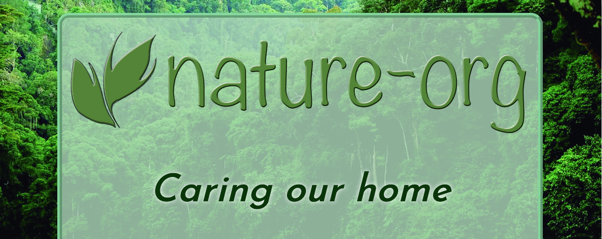
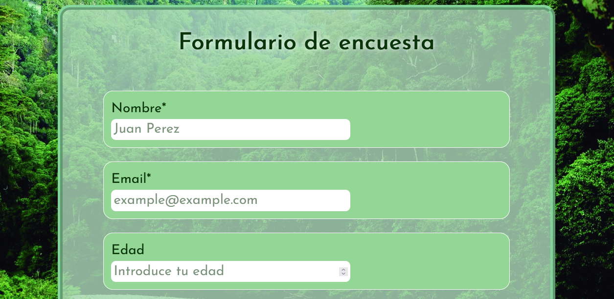

# formulario-encuesta
Ejemplo de formulario de encuesta de organización ficticia nature-org, realizado en HTML5 y CSS como parte de los proyectos del curso de diseño web 
adaptativo (Responsive Web Design) en [freeCodeCamp](https://www.freecodecamp.org/espanol/learn/responsive-web-design/)

//-------------CABECERA-------------//

//-------------SECCIÓN FORMULARIO-------------//

